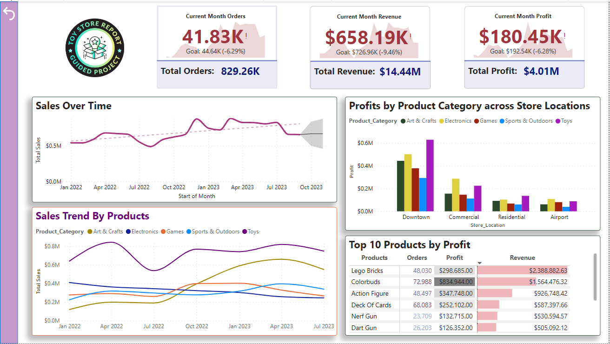
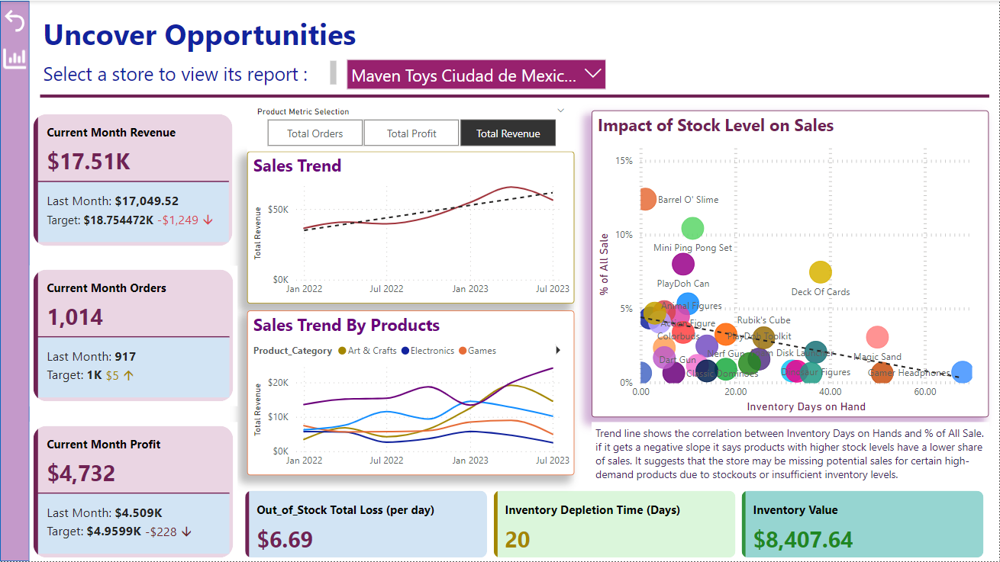

# Toy-Store-Report-by-Power-BI

In this project, we are tasked to prepare an interactive report to visualize high level insights and key business metrics that help the chains of toy stores boost their performance and profit. We are provided with sales & inventory data for a fictitious chain of toy stores in Mexico called Maven Toys, including information about products, stores, daily sales transactions, and current inventory levels at each location.
We use Microsoft Power BI to make the report. Through the project, the skills like data modelling, DAX, and data visualization are required.
# Key Assumptions
Lacking direct access to end users, we presume that we are tasked to address the following essential questions:
1- Are there any seasonal trends or patterns in the sales data?
2- Are sales being lost with out-of-stock products at certain locations?
3- How much money is tied up in inventory at the toy stores? How long will it last?

Beside these questions, we provide an Exec Dashboard that provides a view of the performance of all chains of toy stores. The dashboard sections are explained further below.
# An Overall Perspective

This is the main page of the report, offering a comprehensive overview of the performance of all toy store chains. It includes crucial insights, particularly highlighting the sales trends over time. Some of the trends observed in the “Sales Over Time” chart are:
1- In August 2022 and 2023, the sales chart shows a significant drop, indicating a seasonal trend. This decline is likely due to families preparing for the new school year, which shifts their purchasing priorities. To address this, it is recommended to stock more school-related items during this period.
2- From August to November 2023, we see an upward trend in sales, which peaks in December. If we examine the sales growth chart for each product over time, we find that the growth in sales of Art and Craft items has contributed the most to the overall increase in sales during this period. Sales rise from September to December due to back-to-school needs and holiday preparations, boosting demand for art and craft supplies.
3- High sales in December are likely due to the Christmas holiday. A closer look reveals that sales increase as Christmas approaches.

#Performance by each toy store

This page provides essential information for sales managers and offers valuable insights for store owners and managers to boost profitability. You can analyze the performance of individual stores by selecting their names from the store name filter above.
Key KPIs are prominently displayed on the left side, while the KPIs at the bottom of the page address critical inventory-related questions for each store, such as: Are sales being lost due to out-of-stock items? How much money is tied up in inventory, and how long will it last?
We have also designed an insightful bubble chart that illustrates the impact of stock levels on sales. This chart provides a clear overview of the profitability of the store's inventory and stock levels, offering valuable insights into future sales performance. It helps the store monitor inventory levels, ensuring that high-demand products are adequately stocked to prevent stockouts.
# Conclusion
This dashboard provides a comprehensive view of the performance of different stores within the toy store chain, helping identify areas for improvement and strategic opportunities to enhance sales and profit.
